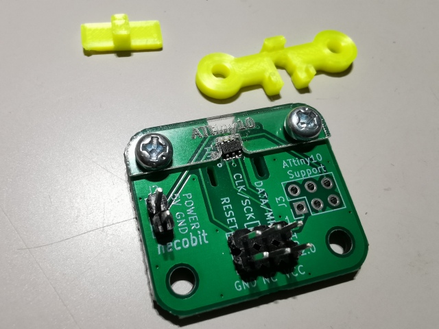

# ATtiny10writingboardjig

[necobitさんのATtiny10書き込み治具](https://necobit.com/denshi/attiny10writingboardandjig/)の黄色いパーツを置き換えて、指で抑えやすくするアタッチメントです。
厚さ1mmのアクリル板、またはもう少し薄い0.5mmくらいの厚紙やPET板をレーザーカッター等でカットして使います。

# Author

Junichi Akita (@akita11, akita@ifdl.jp)

